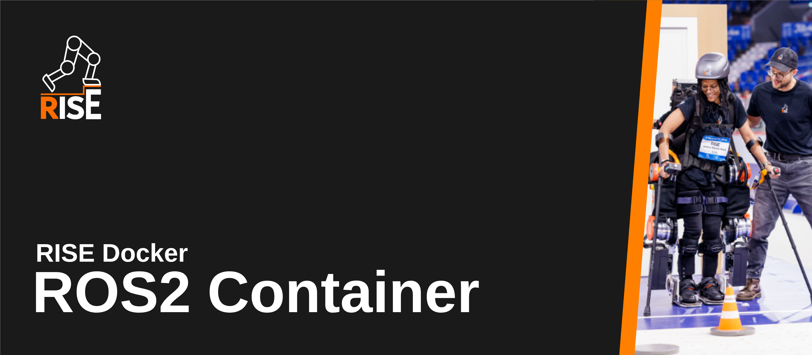

<p align="center">
  
</p>

---

This repository contains the standardized environment for using ROS2 within the RISE project. While the production systems don't run a Docker setup, we use the containerized approach for development purposes. 

## Building

The Docker image is available from the 'packages' menu of this repository. You can pull it from GHCR using:

```bash
docker pull ghcr.io/riserobotics/rise-os:latest
```

If you want to build it yourself locally, use the build script in the root of this repository:

```bash
./build_docker.sh
```

This script will:
- Detect your system architecture (AMD64 or ARM64)
- Set up QEMU for cross-platform emulation
- Build the image for both AMD64 and ARM64 architectures
- Verify that both builds completed successfully

Alternatively, you can build manually with:

```bash
docker build -t rise-os:latest .
```

## Running

Run the container interactively:

```bash
docker run -it --rm ghcr.io/riserobotics/rise-os:latest
```

Or if you built it locally:

```bash
docker run -it --rm rise-os:latest
```

To execute commands in a running container:

```bash
docker exec -it <container_name> /bin/zsh
```

Note: The container uses ZSH with Powerlevel10k theme by default.